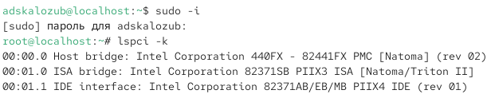
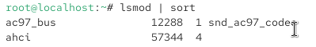
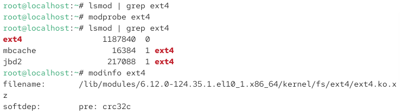
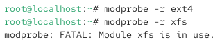
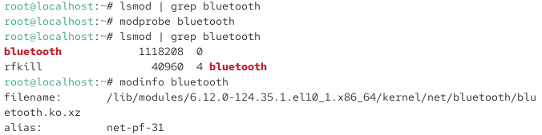
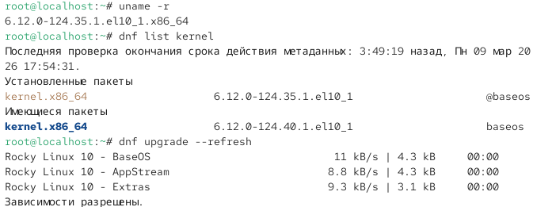
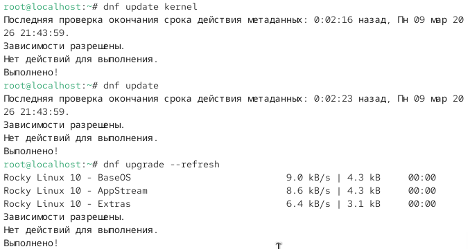
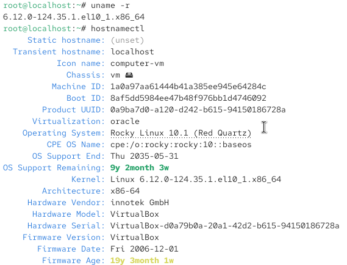

---
## Front matter
title: "Отчёт о лабораторной работе"
subtitle: "Лабораторная работа №10"
author: "Скалозуб Александр"

## Generic otions
lang: ru-RU
toc-title: "Содержание"

## Bibliography
bibliography: bib/cite.bib
csl: pandoc/csl/gost-r-7-0-5-2008-numeric.csl

## Pdf output format
toc: true # Table of contents
toc-depth: 2
lof: true # List of figures
lot: true # List of tables
fontsize: 12pt
linestretch: 1.5
papersize: a4
documentclass: scrreprt
## I18n polyglossia
polyglossia-lang:
  name: russian
  options:
	- spelling=modern
	- babelshorthands=true
polyglossia-otherlangs:
  name: english
## I18n babel
babel-lang: russian
babel-otherlangs: english
## Fonts
mainfont: IBM Plex Serif
romanfont: IBM Plex Serif
sansfont: IBM Plex Sans
monofont: IBM Plex Mono
mathfont: STIX Two Math
mainfontoptions: Ligatures=Common,Ligatures=TeX,Scale=0.94
romanfontoptions: Ligatures=Common,Ligatures=TeX,Scale=0.94
sansfontoptions: Ligatures=Common,Ligatures=TeX,Scale=MatchLowercase,Scale=0.94
monofontoptions: Scale=MatchLowercase,Scale=0.94,FakeStretch=0.9
mathfontoptions:
## Biblatex
biblatex: true
biblio-style: "gost-numeric"
biblatexoptions:
  - parentracker=true
  - backend=biber
  - hyperref=auto
  - language=auto
  - autolang=other*
  - citestyle=gost-numeric
## Pandoc-crossref LaTeX customization
figureTitle: "Рис."
tableTitle: "Таблица"
listingTitle: "Листинг"
lofTitle: "Список иллюстраций"
lotTitle: "Список таблиц"
lolTitle: "Листинги"
## Misc options
indent: true
header-includes:
  - \usepackage{indentfirst}
  - \usepackage{float} # keep figures where there are in the text
  - \floatplacement{figure}{H} # keep figures where there are in the text
---
# Цель работы

Получить навыки работы с утилитами управления модулями ядра операционной системы.

# Задание

Поработать с утилитами управления модулями ядра операционной системы.

# Выполнение лабораторной работы

{#fig:001 width=70%}

Рис 1. выводим информацию

{#fig:002 width=70%}

Рис 2. выводим информацию

{#fig:003 width=70%}

Рис 3. Редактируем файлы

{#fig:004 width=70%}

Рис 4. настройка блютуз модуля

{#fig:005 width=70%}

Рис 5. Изменение конфигурации Рис

{#fig:006 width=70%}

Рис 6. задействование блютуз модуля

{#fig:007 width=70%}

Рис 7. задействование компонента krenel

{#fig:008 width=70%}

Рис 8. тоже самое

{#fig:009 width=70%}

Рис 9. Вывод сводки

# Вывод

Научились работать с модулями ядра 

# Ответы на контрольные вопросы

1. uname -r  

2. uname -a или uname -a && cat /proc/version  

3. lsmod  

4. modinfo <имя_модуля>

5. rmmod <имя_модуля> или modprobe -r <имя_модуля>

6. Проверить зависимости, использовать lsmod или modinfo. Возможно, модуль используется или зависим от других  

7. modinfo <имя_модуля> — там отображаются поддерживаемые параметры.  

8. Установить новую версию ядра через менеджер пакетов вашей ОС (`apt`, yum, dnf и т.п.) и перезагрузите систему.
