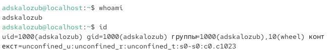
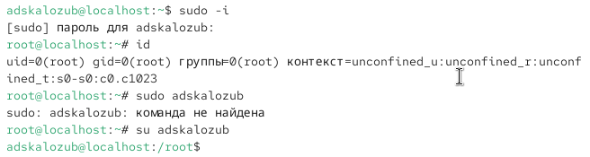
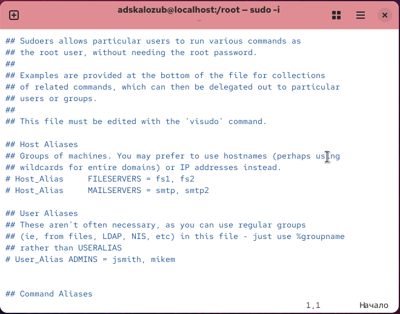
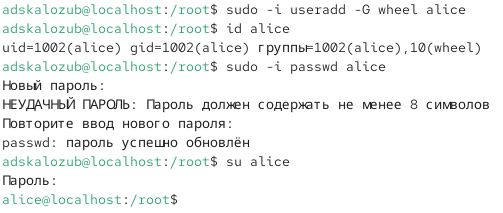
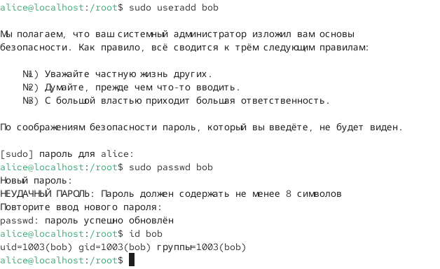
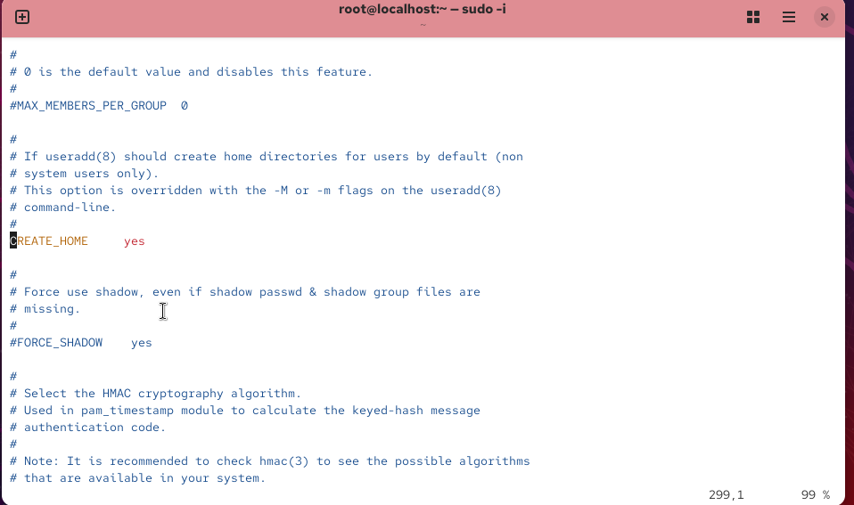
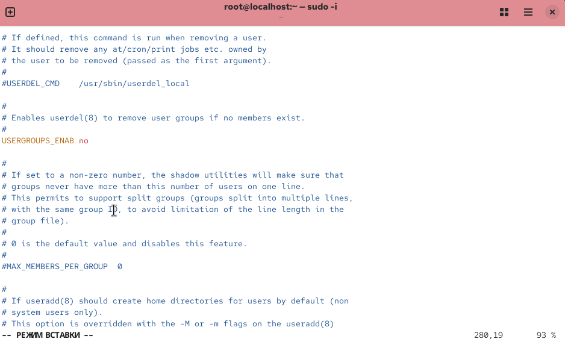
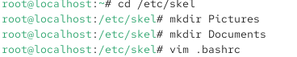
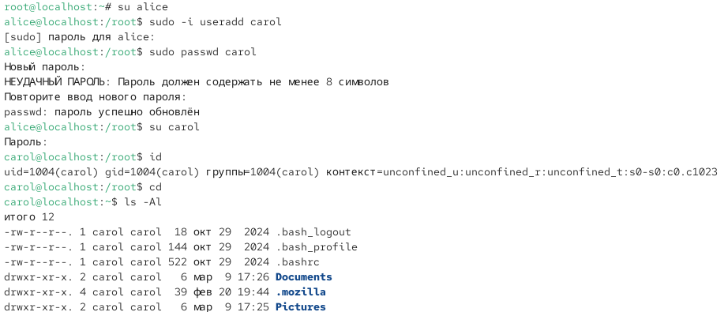
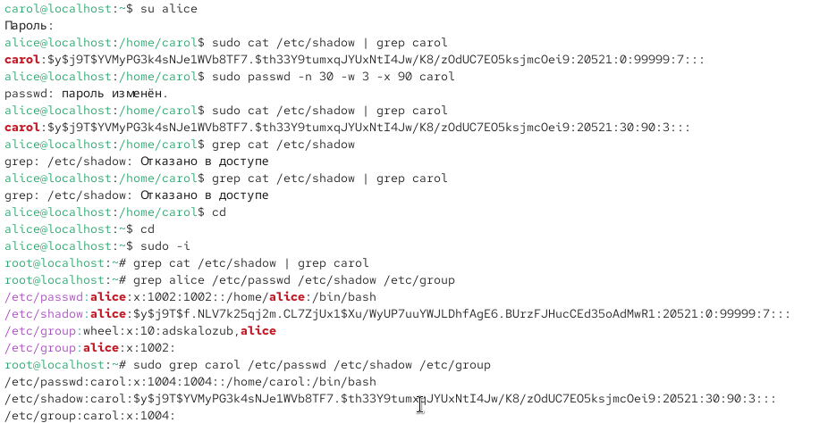

---
## Front matter
title: "Отчёт о лабораторной работе"
subtitle: "Лабораторная работа №11"
author: "Скалозуб Александр"

## Generic otions
lang: ru-RU
toc-title: "Содержание"

## Bibliography
bibliography: bib/cite.bib
csl: pandoc/csl/gost-r-7-0-5-2008-numeric.csl

## Pdf output format
toc: true # Table of contents
toc-depth: 2
lof: true # List of figures
lot: true # List of tables
fontsize: 12pt
linestretch: 1.5
papersize: a4
documentclass: scrreprt
## I18n polyglossia
polyglossia-lang:
  name: russian
  options:
	- spelling=modern
	- babelshorthands=true
polyglossia-otherlangs:
  name: english
## I18n babel
babel-lang: russian
babel-otherlangs: english
## Fonts
mainfont: IBM Plex Serif
romanfont: IBM Plex Serif
sansfont: IBM Plex Sans
monofont: IBM Plex Mono
mathfont: STIX Two Math
mainfontoptions: Ligatures=Common,Ligatures=TeX,Scale=0.94
romanfontoptions: Ligatures=Common,Ligatures=TeX,Scale=0.94
sansfontoptions: Ligatures=Common,Ligatures=TeX,Scale=MatchLowercase,Scale=0.94
monofontoptions: Scale=MatchLowercase,Scale=0.94,FakeStretch=0.9
mathfontoptions:
## Biblatex
biblatex: true
biblio-style: "gost-numeric"
biblatexoptions:
  - parentracker=true
  - backend=biber
  - hyperref=auto
  - language=auto
  - autolang=other*
  - citestyle=gost-numeric
## Pandoc-crossref LaTeX customization
figureTitle: "Рис."
tableTitle: "Таблица"
listingTitle: "Листинг"
lofTitle: "Список иллюстраций"
lotTitle: "Список таблиц"
lolTitle: "Листинги"
## Misc options
indent: true
header-includes:
  - \usepackage{indentfirst}
  - \usepackage{float} # keep figures where there are in the text
  - \floatplacement{figure}{H} # keep figures where there are in the text
---
# Цель работы

Получить навыки работы с загрузчиком системы GRUB2.

# Задание

Поработать с загрузчиком системы GRUB2.

# Выполнение лабораторной работы

{#fig:001 width=70%}

Рис 1. Определяем пользователя и его принадлежности 

{#fig:002 width=70%}

Рис 2. определяем принадлежность админа 

{#fig:003 width=70%}

Рис 3. открываем файл sudoers в редакторе vi и изменяем параметр  %wheel

{#fig:004 width=70%}

Рис 4. создаем пользователя alice и даем ему пароль в принадлежности wheel

{#fig:005 width=70%}

Рис 5. Создаем пользователя bob и делаем те же манипуляции 

{#fig:006 width=70%}

Рис 6. проверяем create\_home на параметр yes

{#fig:007 width=70%}

Рис 7. проверяем usergroups\_enab на значение no и меняем его на no

{#fig:008 width=70%}

Рис 8. создаем директории

{#fig:009 width=70%}

Рис 9. работаем с имеющимися пользователями

{#fig:010 width=70%}

Рис 10. Работаем с пользователями 

{#fig:011 width=70%}

Рис 11. Работаем с группами

# Вывод

Мы научились работать с группами и пользователями в linux

# Выводы

В ходе данной лабораторной работы были получены навыки для работы с загрузчиком системы GRUB2.

# Ответы на контрольные вопросы

1. /etc/default/grub  

2. /boot/grub2/grub.cfg  

3. update-grub или grub2-mkconfig -o /boot/grub2/grub.cfg
