---
## Front matter
title: "Отчёт о лабораторной работе"
subtitle: "Лабораторная работа №14"
author: "Скалозуб Александр"

## Generic otions
lang: ru-RU
toc-title: "Содержание"

## Bibliography
bibliography: bib/cite.bib
csl: pandoc/csl/gost-r-7-0-5-2008-numeric.csl

## Pdf output format
toc: true # Table of contents
toc-depth: 2
lof: true # List of figures
lot: true # List of tables
fontsize: 12pt
linestretch: 1.5
papersize: a4
documentclass: scrreprt
## I18n polyglossia
polyglossia-lang:
  name: russian
  options:
	- spelling=modern
	- babelshorthands=true
polyglossia-otherlangs:
  name: english
## I18n babel
babel-lang: russian
babel-otherlangs: english
## Fonts
mainfont: IBM Plex Serif
romanfont: IBM Plex Serif
sansfont: IBM Plex Sans
monofont: IBM Plex Mono
mathfont: STIX Two Math
mainfontoptions: Ligatures=Common,Ligatures=TeX,Scale=0.94
romanfontoptions: Ligatures=Common,Ligatures=TeX,Scale=0.94
sansfontoptions: Ligatures=Common,Ligatures=TeX,Scale=MatchLowercase,Scale=0.94
monofontoptions: Scale=MatchLowercase,Scale=0.94,FakeStretch=0.9
mathfontoptions:
## Biblatex
biblatex: true
biblio-style: "gost-numeric"
biblatexoptions:
  - parentracker=true
  - backend=biber
  - hyperref=auto
  - language=auto
  - autolang=other*
  - citestyle=gost-numeric
## Pandoc-crossref LaTeX customization
figureTitle: "Рис."
tableTitle: "Таблица"
listingTitle: "Листинг"
lofTitle: "Список иллюстраций"
lotTitle: "Список таблиц"
lolTitle: "Листинги"
## Misc options
indent: true
header-includes:
  - \usepackage{indentfirst}
  - \usepackage{float} # keep figures where there are in the text
  - \floatplacement{figure}{H} # keep figures where there are in the text
---
# Цель работы

Получить навыки создания разделов на диске и файловых систем. Получить навыки монтирования файловых систем.

# Задание

Научиться создавать разделы на диске и файловые системы, монтировать файловые системы.

# Выполнение лабораторной работы

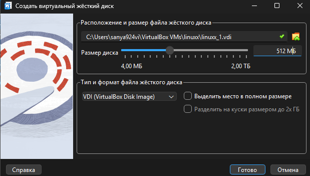{#fig:001 width=70%}

Рис 1. Создаем виртуальный диск

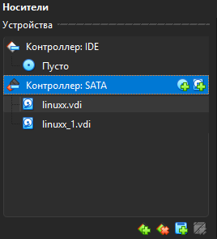{#fig:002 width=70%}

Рис 2. Диск создан

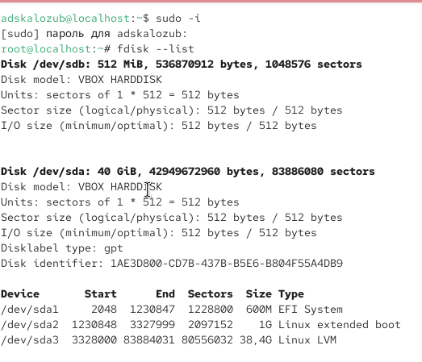{#fig:003 width=70%}

Рис 3. Проверка дисков

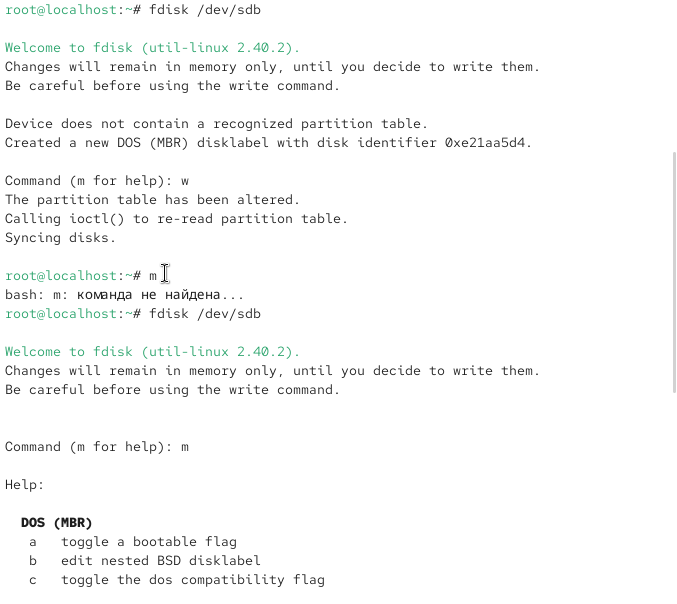{#fig:004 width=70%}

Рис 4. Проверка инструментов

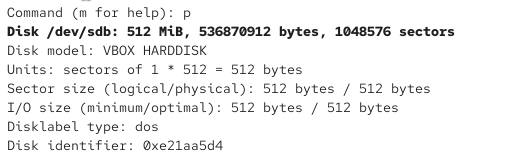{#fig:005 width=70%}

Рис 5. Вывод информации

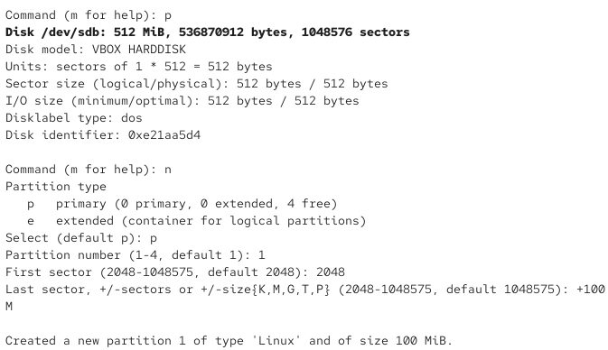{#fig:006 width=70%}

Рис 6. Создаем раздел размером в 100 Мбайт

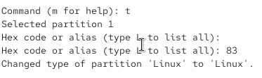{#fig:008 width=70%}

Рис 7. изменяем раздел

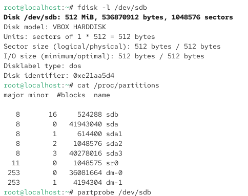{#fig:009 width=70%}

Рис 8. Проверка 

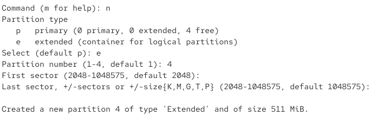{#fig:010 width=70%}

Рис 9. Создаем новый раздел 

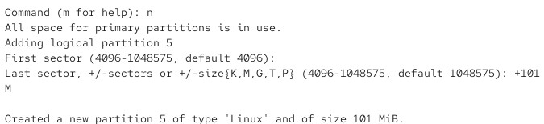{#fig:011 width=70%}

Рис 10. Создаем новый раздел

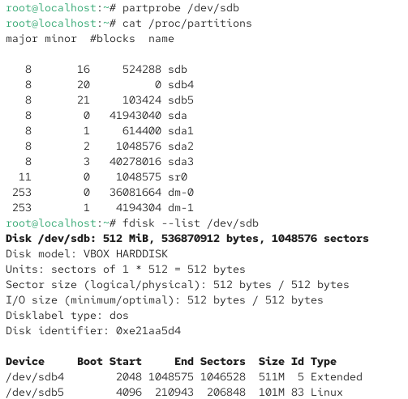{#fig:012 width=70%}

Рис 11. проверка  

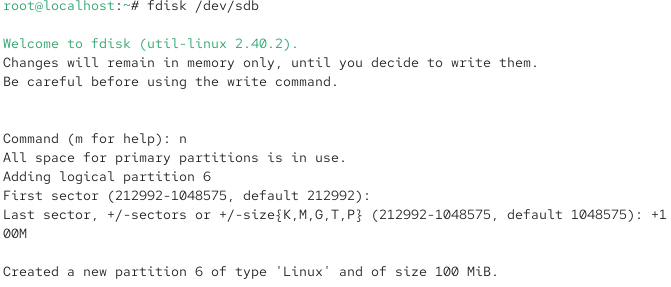{#fig:013 width=70%}

Рис 12. создание раздела 

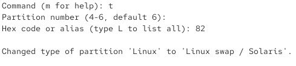{#fig:014 width=70%}

Рис 13. Выбираем раздел

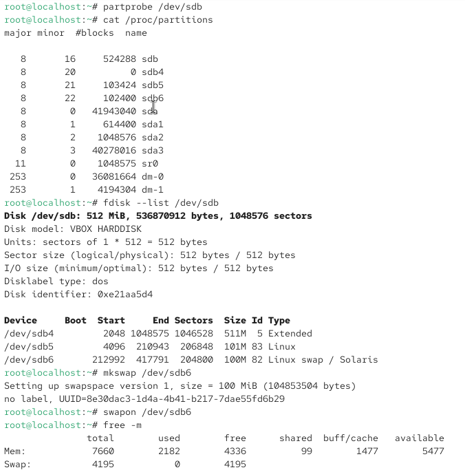{#fig:015 width=70%}

Рис 14. Проверка 

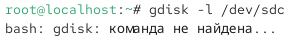{#fig:016 width=70%}

Рис 15. Не удалось выполнить этап из-за

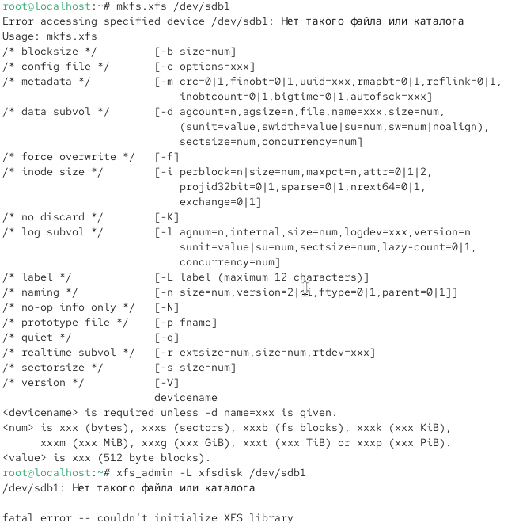{#fig:017 width=70%}
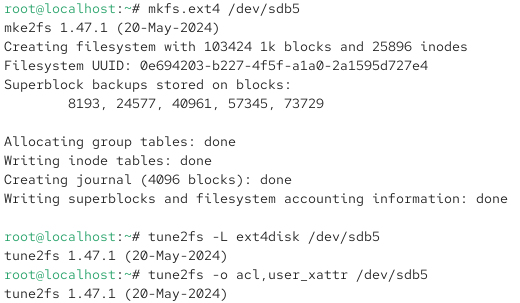{#fig:018 width=70%}
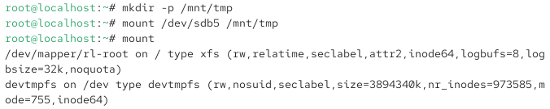{#fig:019 width=70%}

Рис 16. вывод информации

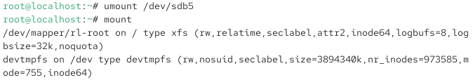{#fig:020 width=70%}

Рис 17. вывод информации

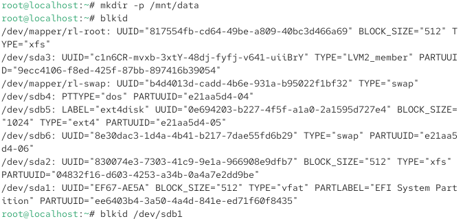{#fig:021 width=70%}

Рис 18. Настройка раздела и проверка

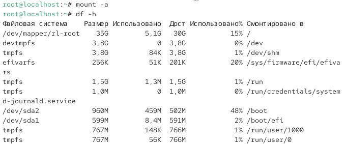{#fig:022 width=70%}

Рис 19. Настройка и проверка

{#fig:023 width=70%}

Рис 20. Создаем директорию и выводим информацию

{#fig:024 width=70%}

Рис 21. Выводим информацию по разделам

# Вывод

Научились создавать и редактировать разделы дисков

# Ответы на контрольные вопросы

1. gdisk или parted

2. используется fdisk

3. файл /etc/fstab

4. в /etc/fstab опция noauto

5. mkswap /dev/имя_раздела

6. mount -a

7. создаётся файловая система ext2

8. mkfs.ext4 /dev/имя_раздела

9. blkid