---
## Front matter
title: "Отчёт о лабораторной работе"
subtitle: "Лабораторная работа №4"
author: "Скалозуб Александр"

## Generic otions
lang: ru-RU
toc-title: "Содержание"

## Bibliography
bibliography: bib/cite.bib
csl: pandoc/csl/gost-r-7-0-5-2008-numeric.csl

## Pdf output format
toc: true # Table of contents
toc-depth: 2
lof: true # List of figures
lot: true # List of tables
fontsize: 12pt
linestretch: 1.5
papersize: a4
documentclass: scrreprt
## I18n polyglossia
polyglossia-lang:
  name: russian
  options:
	- spelling=modern
	- babelshorthands=true
polyglossia-otherlangs:
  name: english
## I18n babel
babel-lang: russian
babel-otherlangs: english
## Fonts
mainfont: IBM Plex Serif
romanfont: IBM Plex Serif
sansfont: IBM Plex Sans
monofont: IBM Plex Mono
mathfont: STIX Two Math
mainfontoptions: Ligatures=Common,Ligatures=TeX,Scale=0.94
romanfontoptions: Ligatures=Common,Ligatures=TeX,Scale=0.94
sansfontoptions: Ligatures=Common,Ligatures=TeX,Scale=MatchLowercase,Scale=0.94
monofontoptions: Scale=MatchLowercase,Scale=0.94,FakeStretch=0.9
mathfontoptions:
## Biblatex
biblatex: true
biblio-style: "gost-numeric"
biblatexoptions:
  - parentracker=true
  - backend=biber
  - hyperref=auto
  - language=auto
  - autolang=other*
  - citestyle=gost-numeric
## Pandoc-crossref LaTeX customization
figureTitle: "Рис."
tableTitle: "Таблица"
listingTitle: "Листинг"
lofTitle: "Список иллюстраций"
lotTitle: "Список таблиц"
lolTitle: "Листинги"
## Misc options
indent: true
header-includes:
  - \usepackage{indentfirst}
  - \usepackage{float} # keep figures where there are in the text
  - \floatplacement{figure}{H} # keep figures where there are in the text
---
# Цель работы

Получить навыки работы с репозиториями и менеджерами пакетов.

# Задание

Поработать с менеджером пакетов и репозиториями 

# Выполнение лабораторной работы

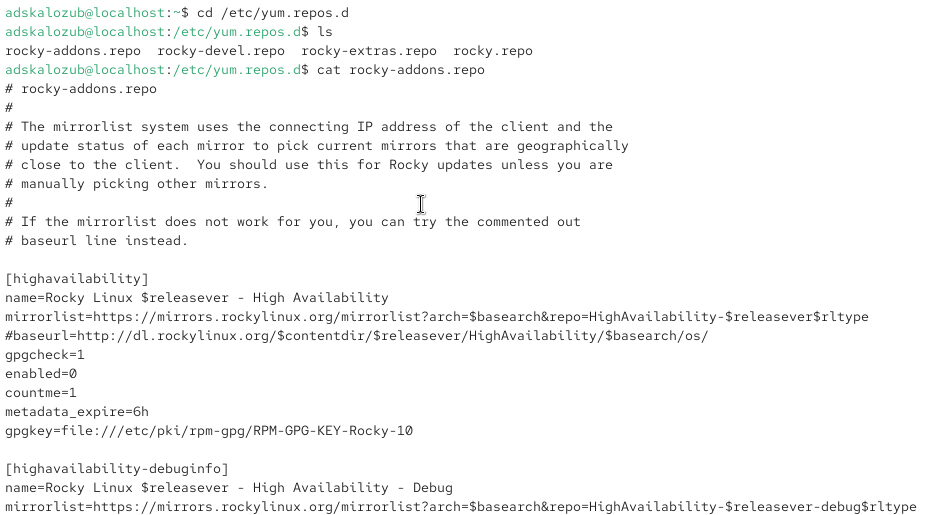{#fig:001 width=70%}

Рис 1. работа с директорией

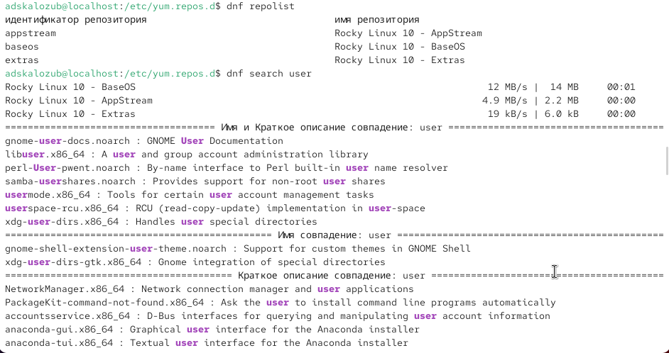{#fig:002 width=70%}

Рис 2. Учимся устанавливать и удалять с помощью команды dnf

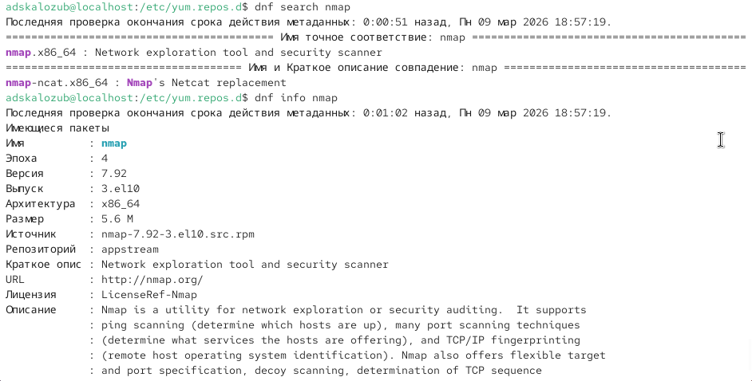{#fig:003 width=70%}

Рис 3. так же

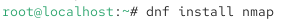{#fig:004 width=70%}

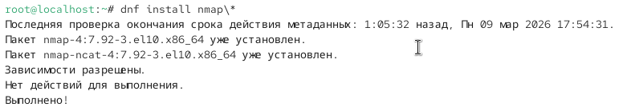{#fig:005 width=70%}

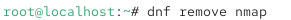{#fig:006 width=70%}

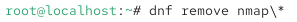{#fig:007 width=70%}

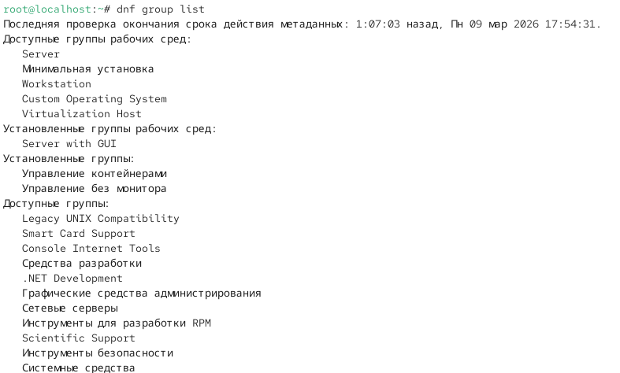{#fig:008 width=70%}

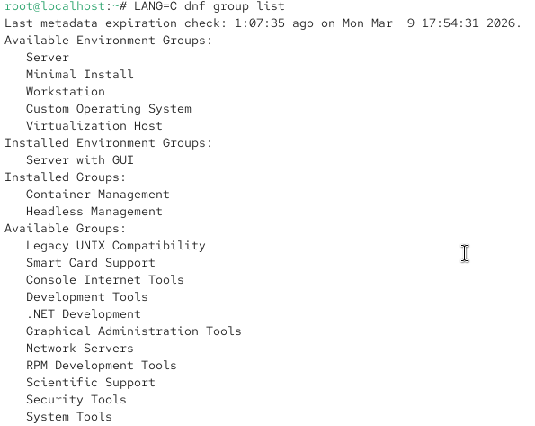{#fig:009 width=70%}

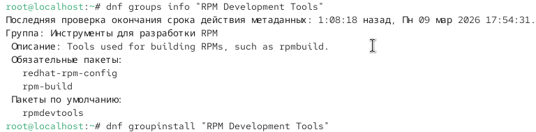{#fig:010 width=70%}

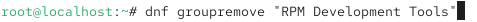{#fig:011 width=70%}

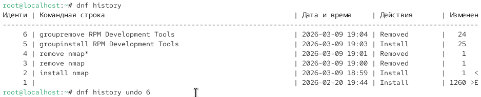{#fig:012 width=70%}

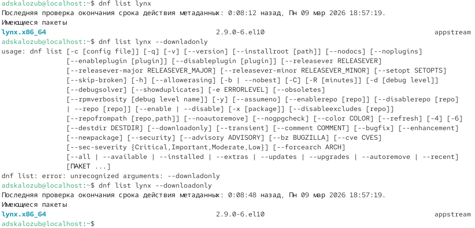{#fig:013 width=70%}

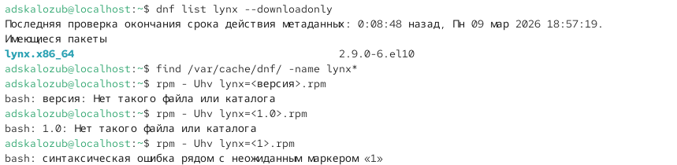{#fig:014 width=70%}

Рис 4. управляем с помощью rpm и find

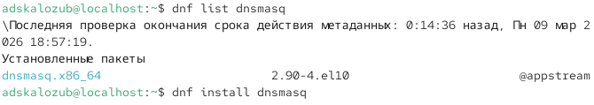{#fig:015 width=70%}

Рис 5. установка необходимого

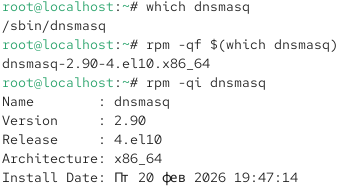{#fig:016 width=70%}

Рис. 6 проверка данных

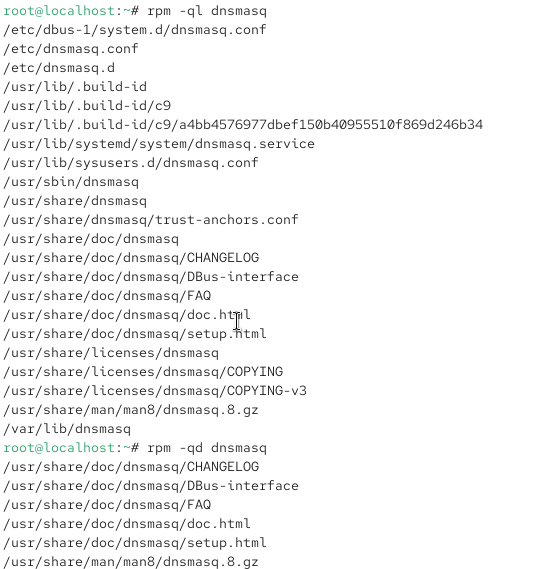{#fig:016 width=70%}

Рис. 7 проверка данных

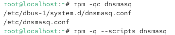{#fig:017 width=70%}

Рис. 8 проверка данных

# Выводы

Научились ставит необходимые компоненты

# Ответы на контрольные вопросы

1. rpm -qf /usr/sbin/useradd

2. getent group dnf  
groups dnf

3. dnf install <имя_пакета> или yum install <имя_пакета>

4. rpm -K <файл.rpm> или rpm -qp --scripts <файл.rpm> 

5. rpm -qd или rpm -q --info

6. rpm -qf <файл>