---
## Front matter
title: "Отчёт о лабораторной работе"
subtitle: "Лабораторная работа №5"
author: "Скалозуб Александр"

## Generic otions
lang: ru-RU
toc-title: "Содержание"

## Bibliography
bibliography: bib/cite.bib
csl: pandoc/csl/gost-r-7-0-5-2008-numeric.csl

## Pdf output format
toc: true # Table of contents
toc-depth: 2
lof: true # List of figures
lot: true # List of tables
fontsize: 12pt
linestretch: 1.5
papersize: a4
documentclass: scrreprt
## I18n polyglossia
polyglossia-lang:
  name: russian
  options:
	- spelling=modern
	- babelshorthands=true
polyglossia-otherlangs:
  name: english
## I18n babel
babel-lang: russian
babel-otherlangs: english
## Fonts
mainfont: IBM Plex Serif
romanfont: IBM Plex Serif
sansfont: IBM Plex Sans
monofont: IBM Plex Mono
mathfont: STIX Two Math
mainfontoptions: Ligatures=Common,Ligatures=TeX,Scale=0.94
romanfontoptions: Ligatures=Common,Ligatures=TeX,Scale=0.94
sansfontoptions: Ligatures=Common,Ligatures=TeX,Scale=MatchLowercase,Scale=0.94
monofontoptions: Scale=MatchLowercase,Scale=0.94,FakeStretch=0.9
mathfontoptions:
## Biblatex
biblatex: true
biblio-style: "gost-numeric"
biblatexoptions:
  - parentracker=true
  - backend=biber
  - hyperref=auto
  - language=auto
  - autolang=other*
  - citestyle=gost-numeric
## Pandoc-crossref LaTeX customization
figureTitle: "Рис."
tableTitle: "Таблица"
listingTitle: "Листинг"
lofTitle: "Список иллюстраций"
lotTitle: "Список таблиц"
lolTitle: "Листинги"
## Misc options
indent: true
header-includes:
  - \usepackage{indentfirst}
  - \usepackage{float} # keep figures where there are in the text
  - \floatplacement{figure}{H} # keep figures where there are in the text
---
# Цель работы

Получить навыки управления системными службами операционной системы посредством systemd.

# Задание

Научится управлять системными службами операционной системы посредством systemd

# Выполнение лабораторной работы

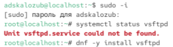{#fig:001 width=70%}

Рис 1. устанавливаем vsftpd

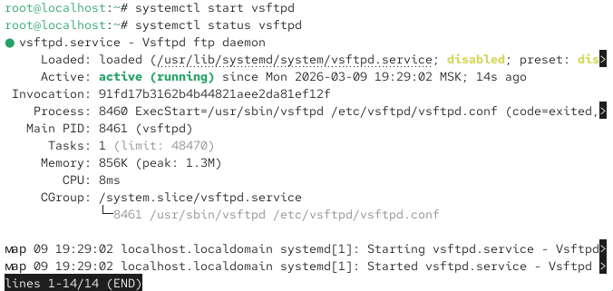{#fig:002 width=70%}

Рис 2. смотрим статус vsftpd

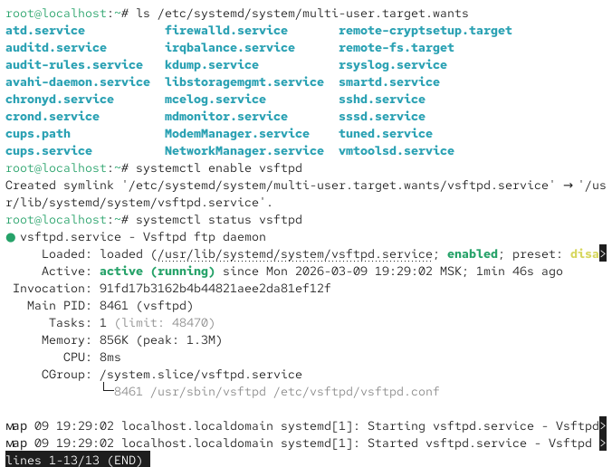{#fig:003 width=70%}

Рис 3. подключение systemctl

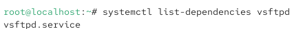{#fig:004 width=70%}

Рис 4. выводим systemctl

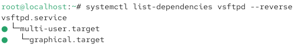{#fig:005 width=70%}

Рис 5. выводим systemctl

{#fig:006 width=70%}

Рис 6. устанавливаем необходимые пакеты

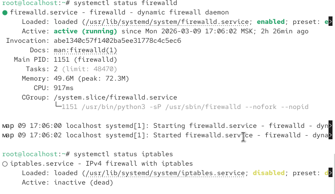{#fig:007 width=70%}

Рис 7. выводим статус

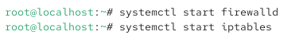{#fig:008 width=70%}

Рис 8. запускаем службы

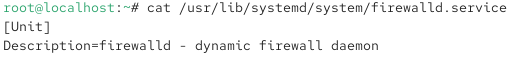{#fig:009 width=70%}

Рис 9. смотрим параметры

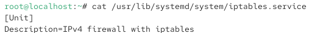{#fig:010 width=70%}

Рис 10. смотрим параметры

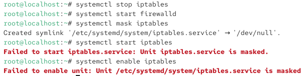{#fig:011 width=70%}

Рис 11. редактируем параметры systemctl

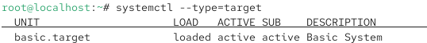{#fig:012 width=70%}

Рис 12. смотрим параметры

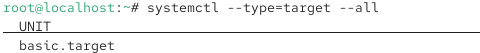{#fig:012 width=70%}

Рис 13. смотрим параметры

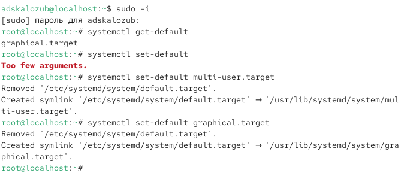{#fig:013 width=70%}

Рис 14. выстав параметры

# Выводы

Мы научились работать со службами

# Ответы на контрольные вопросы

1. Юнит — единица systemd (сервис, таймер). Примеры: nginx.service, backup.timer.  

2. systemctl disable <цель> или systemctl is-enabled <цель>.  

3. systemctl list-units --type=service.  

4. systemctl add-wants <unit> <target>.  

5. systemctl rescue.  

6. Цель не может быть изолирована из-за зависимостей или активных юнитов.  

7. systemctl list-dependencies <служба>.