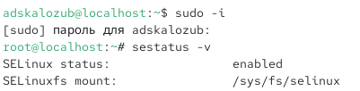
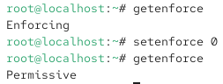
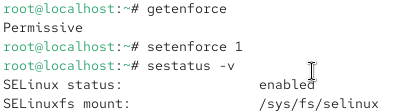
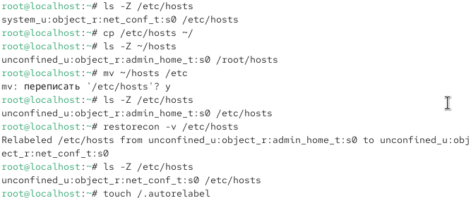
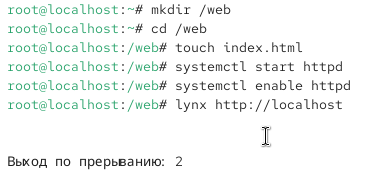
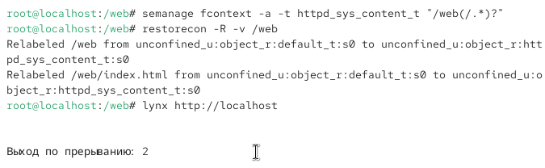
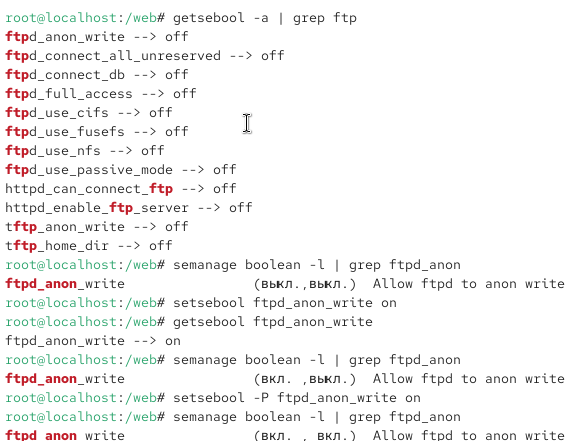

---
## Front matter
title: "Отчёт о лабораторной работе"
subtitle: "Лабораторная работа №9"
author: "Скалозуб Александр"

## Generic otions
lang: ru-RU
toc-title: "Содержание"

## Bibliography
bibliography: bib/cite.bib
csl: pandoc/csl/gost-r-7-0-5-2008-numeric.csl

## Pdf output format
toc: true # Table of contents
toc-depth: 2
lof: true # List of figures
lot: true # List of tables
fontsize: 12pt
linestretch: 1.5
papersize: a4
documentclass: scrreprt
## I18n polyglossia
polyglossia-lang:
  name: russian
  options:
	- spelling=modern
	- babelshorthands=true
polyglossia-otherlangs:
  name: english
## I18n babel
babel-lang: russian
babel-otherlangs: english
## Fonts
mainfont: IBM Plex Serif
romanfont: IBM Plex Serif
sansfont: IBM Plex Sans
monofont: IBM Plex Mono
mathfont: STIX Two Math
mainfontoptions: Ligatures=Common,Ligatures=TeX,Scale=0.94
romanfontoptions: Ligatures=Common,Ligatures=TeX,Scale=0.94
sansfontoptions: Ligatures=Common,Ligatures=TeX,Scale=MatchLowercase,Scale=0.94
monofontoptions: Scale=MatchLowercase,Scale=0.94,FakeStretch=0.9
mathfontoptions:
## Biblatex
biblatex: true
biblio-style: "gost-numeric"
biblatexoptions:
  - parentracker=true
  - backend=biber
  - hyperref=auto
  - language=auto
  - autolang=other*
  - citestyle=gost-numeric
## Pandoc-crossref LaTeX customization
figureTitle: "Рис."
tableTitle: "Таблица"
listingTitle: "Листинг"
lofTitle: "Список иллюстраций"
lotTitle: "Список таблиц"
lolTitle: "Листинги"
## Misc options
indent: true
header-includes:
  - \usepackage{indentfirst}
  - \usepackage{float} # keep figures where there are in the text
  - \floatplacement{figure}{H} # keep figures where there are in the text
---
# Цель работы

Получить навыки работы с контекстом безопасности и политиками SELinux.

# Задание

Поработать с контекстом безопасности и политиками SELinux.

# Выполнение лабораторной работы

{#fig:001 width=70%}

Рис 1. Выводим статус

{#fig:002 width=70%}

Рис 2. Меняем конфигурацию

{#fig:003 width=70%}

Рис 3. Меняем конфигурации и смотрим статус

{#fig:004 width=70%}

Рис 4. Редактируем host

{#fig:005 width=70%}

Рис 5. создаем и редактируем файл web

{#fig:006 width=70%}

Рис 6. пере-балансируем файл запуска сайта

{#fig:007 width=70%}

Рис 7. Настройка конфигурации

# Выводы

Научились пользоваться SELinux

# Ответы на контрольные вопросы

1. setenforce 1  

2. sestatus -v или semanage boolean -l  

3. setroubleshoot (или sealert`) — пакет называется `setroubleshoot  

4. chcon -t httpd_sys_content_t /web и restorecon -Rv /web  

5. Изменить или удалить файл /etc/selinux/config  

6. /var/log/audit/audit.log  

7. seinfo -t ftp или semanage fcontext -l  

8. Проверить журнал /var/log/audit/audit.log или использовать sealert для диагностики
